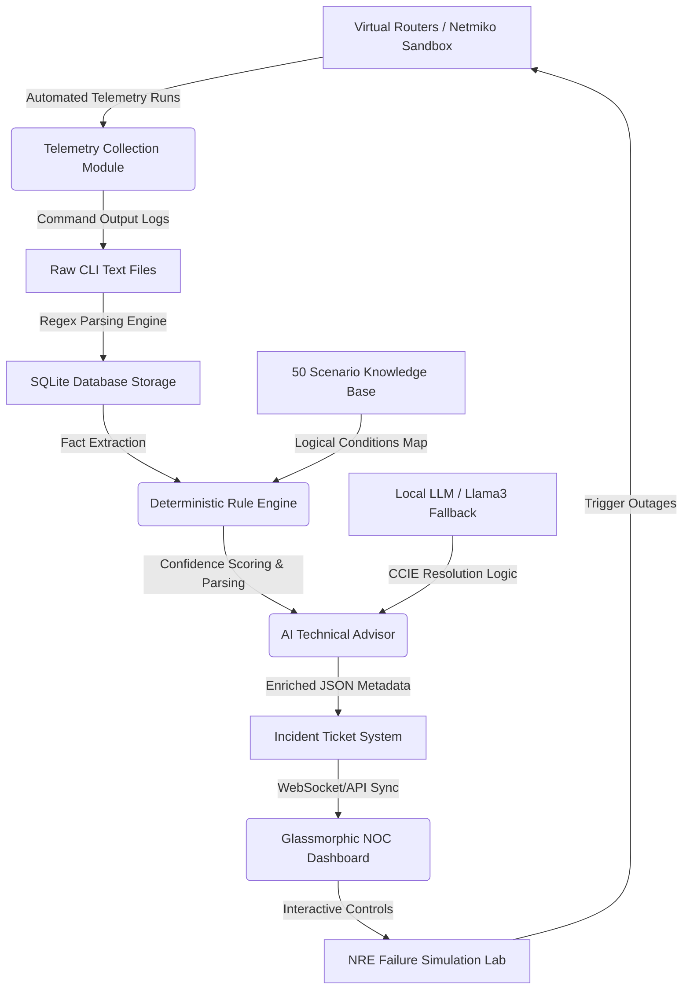

# 🌐 NetSage: AI-Powered Network Troubleshooting & NOC Assurance Assistant

NetSage is an enterprise-grade full-stack **Network Operations Center (NOC) and Network Reliability Engineering (NRE)** assurance platform. It automatically collects telemetry from virtual routers, evaluates device states against a deterministic expert rule engine, predicts cascading failures with weighted confidence scores, enriches root causes via a local LLM AI Advisor, and visualizes network outages in a high-fidelity glassmorphic React dashboard.

Designed to eliminate manual network diagnostics, NetSage acts as a dynamic pilot for virtualized labs, NetDevOps workflows, and automated network troubleshooting pipelines.

---

## 🚀 Key Features

*   **📺 Real-Time NOC Monitor Dashboard:** Built with a stunning dark-mode glassmorphic visual aesthetic, presenting high-contrast health status widgets and reactive interface parameters.
*   **🔌 Live SVG Topology Map:** Displays end-to-end client-server transit paths with **animated packet flow lines** that change dynamics (pulsing, yellow degraded, or red severed) in response to network status.
*   **📊 Deterministic Rule-Based Analysis:** Features a structured logic processor matched against **50 predefined network troubleshooting scenarios** (covering OSPF, routing, physical lines, NAT, and security ACLs).
*   **🧠 AI Technical Advisor Layer:** Harnesses a local LLM (`Llama 3` or `Mistral` via Ollama) to enrich matched rule engine faults, outputting detailed CCIE-level resolution logs, remediation CLI steps, and risk level matrix guides.
*   **🖥️ Cisco IOS Terminal Emulator:** Connects directly to the backend simulated nodes, supporting live interactive CLI diagnostics (e.g. `show ip ospf neighbor`, `show processes cpu`) and quick-trigger drawer shortcuts.
*   **📈 Historical Analytics Suite:** Monitors Mean Time to Detect (MTTD), Mean Time to Resolve (MTTR), incident trends, and top failing components.
*   **📋 Compliance Exporters:** Generates instant executive-ready reports in **PDF**, standalone stylized **HTML**, or raw **CSV** log spreadsheets.

---

## 🏗️ Architecture & High-Level Workflow



---

## 📐 Virtual Network Topology

NetSage monitors a multi-stage enterprise core network structured horizontally:

```text
[Client Host] ─── [HO Switch] ─── [R1 Router] ─── [R2 Router] ─── [R3 Router] ─── [DC Switch] ─── [App Server]
192.168.1.50                       (Head Office)    (Transit)      (Datacenter)                     192.168.4.10
```

*   **Routing Protocols:** OSPF (Area 0), Static fallback routing.
*   **Filters & Policies:** Standard and Extended Access Control Lists (ACLs).

---

## 🛠️ Tech Stack

*   **Frontend:** React 19, Lucide React (Visual Icons), CSS3 Grid & Flexbox (Tailwind Fallbacks).
*   **Backend:** FastAPI (Python), SQLite Database, SQLAlchemy (ORM), Netmiko (SSH Telemetry Handler).
*   **AI Integration:** Ollama API Interface.

---

## 💻 Getting Started

### 1. Prerequisites
Ensure you have the following installed:
*   Python 3.10+
*   Node.js 18+
*   (Optional) Ollama running `llama3` locally for dynamic AI advice.

### 2. Backend Installation & Run
1.  Navigate to the backend directory:
    ```bash
    cd backend
    ```
2.  Install dependencies:
    ```bash
    pip install -r requirements.txt
    ```
3.  Launch the FastAPI server:
    ```bash
    python run.py
    ```
    The backend server will spin up on **`http://localhost:8000`** and automatically initialize default devices, SQLite schemas, and baseline configurations.

### 3. Frontend Installation & Run
1.  Navigate to the frontend directory:
    ```bash
    cd frontend
    ```
2.  Install Node dependencies:
    ```bash
    npm install
    ```
3.  Launch the Vite developer server:
    ```bash
    npm run dev
    ```
    Open your browser at **`http://localhost:5173`** to access the live dashboard interface!

---

## 🧪 NRE Failure Simulation Laboratory Scenarios

The platform includes a built-in simulation suite to demonstrate root-cause isolation:

1.  **Scenario 1: OSPF Area Mismatch**
    *   *Simulated Event:* Configures mismatched areas (Area 0 vs 10) on the R1-R2 link.
    *   *Result:* Neighbor state falls to DOWN, triggering OSPF Adjacency Incident with high confidence.
2.  **Scenario 2: OSPF Cryptographic Key Mismatch**
    *   *Simulated Event:* Modifies the MD5 authentication key on R2.
    *   *Result:* signature verification drops, stopping route distribution.
3.  **Scenario 3: Interface Shutdown**
    *   *Simulated Event:* Issues an administrative `shutdown` command on R2's Gi0/1 interface.
    *   *Result:* Link highlights red on topology, marking the server unreachable.
4.  **Scenario 4: Missing Return Route**
    *   *Simulated Event:* Removes R3's static fallback route to the client network.
    *   *Result:* Triggers asymmetric routing failure; pings reach server but responses are black-holed.
5.  **Scenario 5: ACL Client Block**
    *   *Simulated Event:* Applies a security ACL denying the client subnet access.
    *   *Result:* Access list hit counts increment, showing explicit policy drops on R3.
6.  **Scenario 6: Control Plane CPU Exhaustion**
    *   *Simulated Event:* Triggers an IP switching loop on R1.
    *   *Result:* CPU utilization spikes to 98%, packet latency increases, and input buffers queue drops are logged.

---

## 📄 License
This project is licensed under the MIT License - see the LICENSE details for info.
